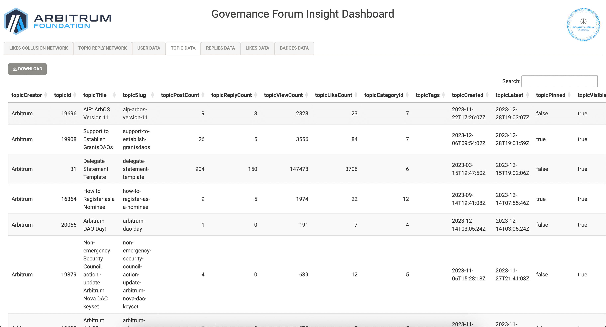
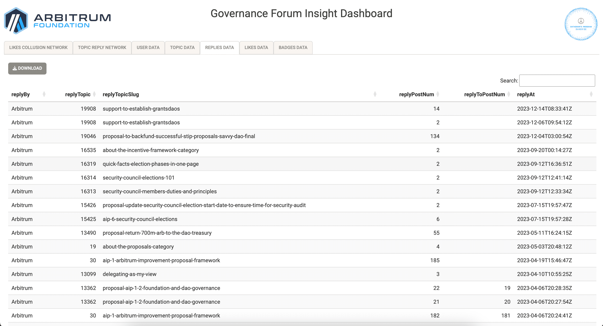

# ArbGovernanceInsightToolkit
Governance Forum Analyzer: A comprehensive toolkit for scraping, extracting, analyzing, and visualizing data to uncover patterns of support and potential centralization of power within governance forums.

## [App Walkthrough on YouTube](https://www.youtube.com/watch?v=H) <<< Click Here

## [App deployed on a tiny droplet](http://143.198:4539) <<< Click Here

The package has 3 Functionalities
- [Pull Data : To pull all types of data from `https://forum.arbitrum.foundation`](https://github.com/yogesh-bansal/ArbGovernanceInsightToolkit#pull-data-functionality)
- [Explore Data : To Analyse and explore patterns of support and potential centralization of power within governance forums](https://github.com/yogesh-bansal/ArbGovernanceInsightToolkit#data-exploration-functionality)
- [Export Data : To export the Governance Forum Data in nicely formatted CSV files](https://github.com/yogesh-bansal/ArbGovernanceInsightToolkit#data-export-functionality)

## Pull Data Functionality

### Walkthrough

#### 1. Scrape all the governance forum data.

- `Rscript scrape.R`

#### 2. Parse all the data in nicely formatted CSV files.

- `Rscript parse.R`

User Statistics DataFrame in data/UsersDF.csv

Topics Statistics DataFrame in data/TopicsDF.csv

Replies/Comments Details DataFrame in data/RepliesDF.csv

Likes on Comments/Replies Details DataFrame in data/LikesDF.csv

## Data Exploration Functionality

### Description

Our `ArbGovernanceInsightToolkit` package contains a shiny app which analyzes and visualizes data to uncover patterns of support and potential centralization of power within governance forums.

### Walkthrough

#### 1. Start the Shiny App

- Open R console and Type `shiny::runApp()`

Network showing users potentially colluding by liking Topics and Comments created by certain Users

Network showing users potentially colluding by Posting Comments/Replies on Topics created by certain Users

## Data Export Functionality

### Description

Our `ArbGovernanceInsightToolkit` package contains a shiny app which have the option to look into the governance raw data like sorting searching and exporting it as well.

Users Data

Topics Data

Replies Data

Likes Data

